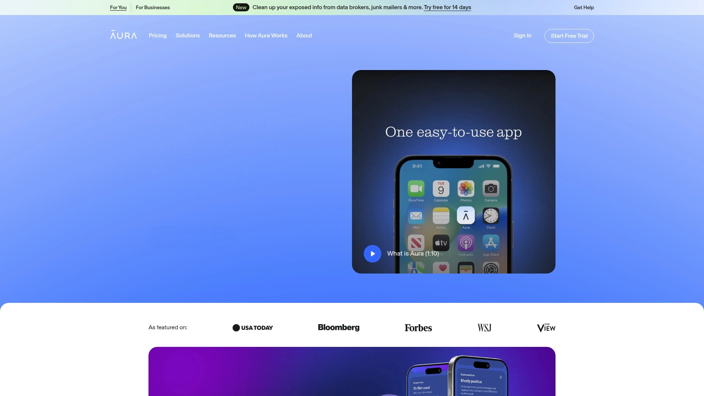
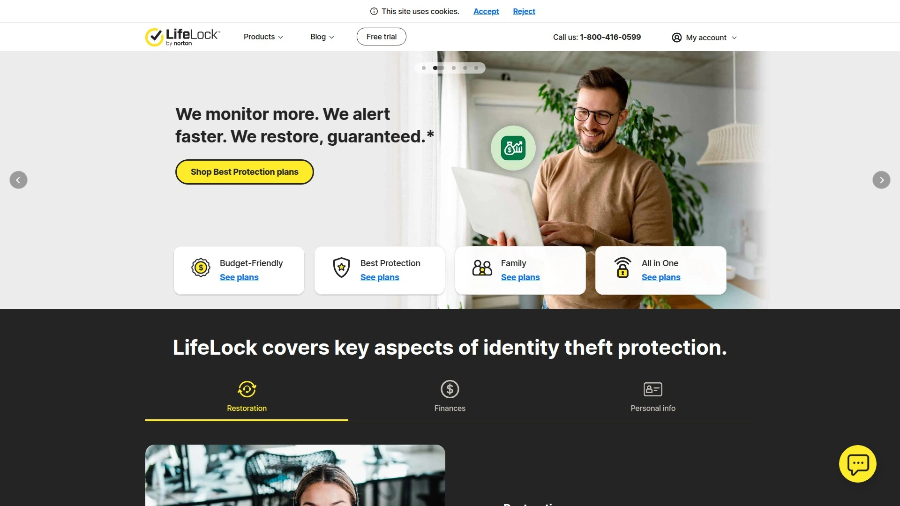
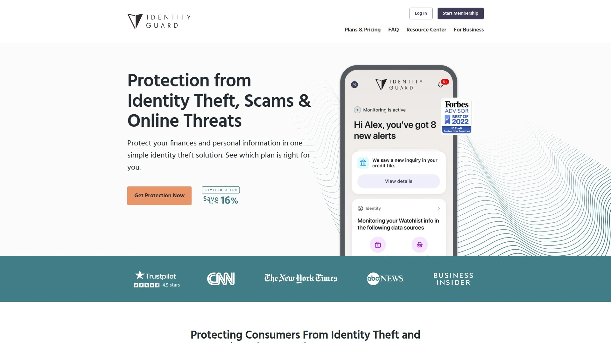
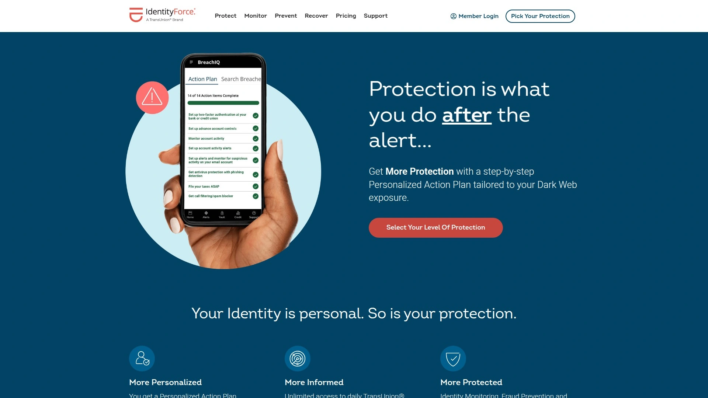
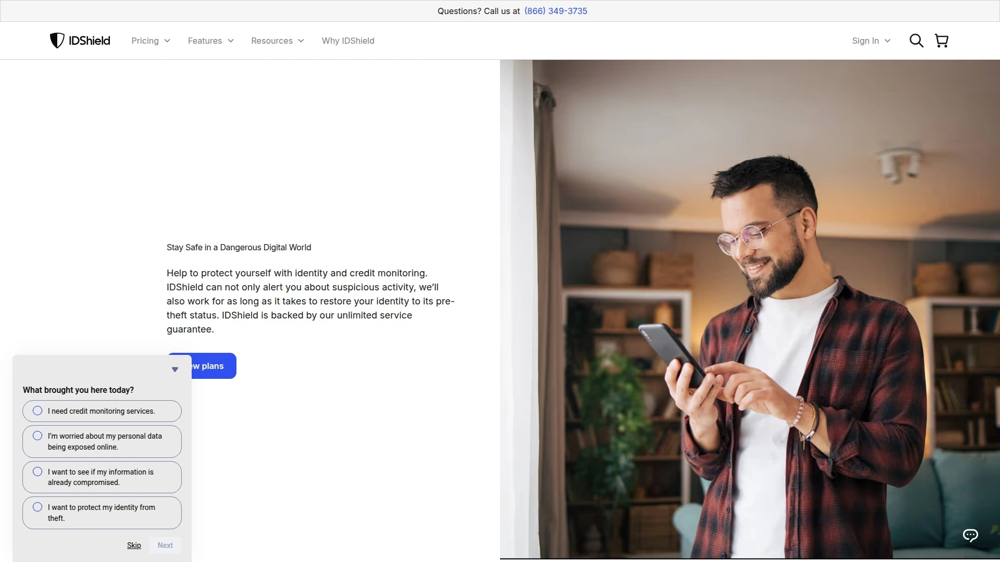
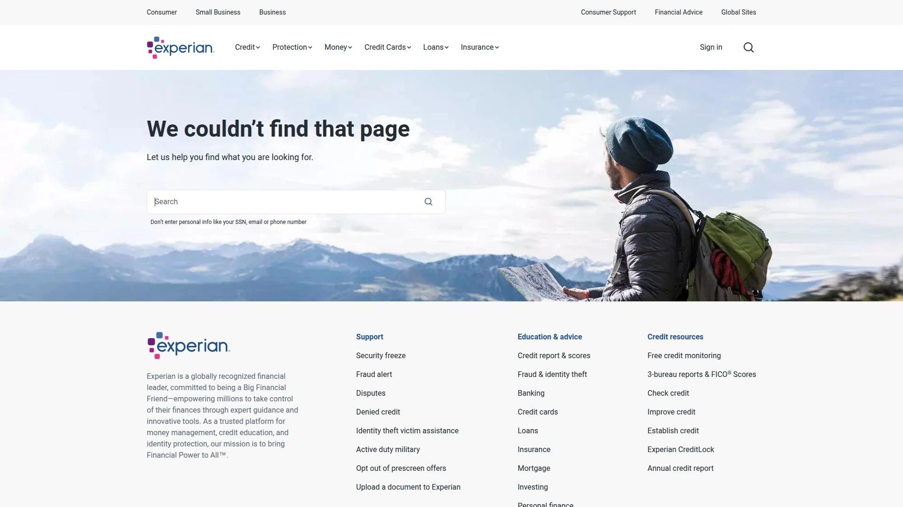
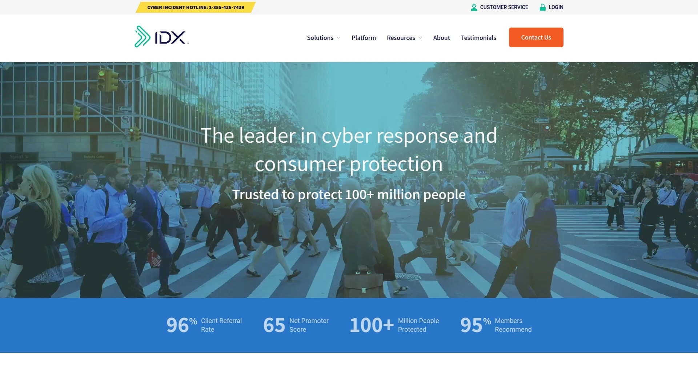
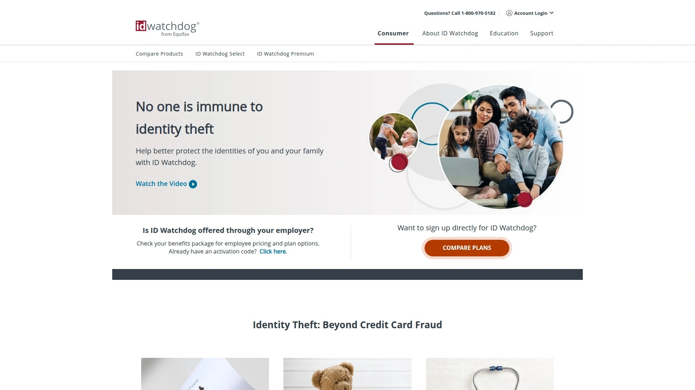
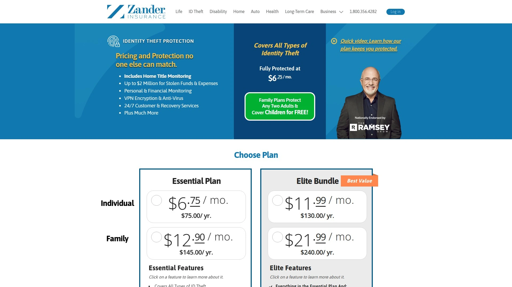

# Top 10 Best Identity Theft Protection Services in 2025

In today's digital world, identity theft can strike anyone through data breaches or online scams, leading to financial loss and stress. Services focused on identity theft protection, credit monitoring, and fraud alerts help by scanning for threats in real-time and alerting you instantly. With features like VPN for privacy and antivirus integration, these options deliver broader coverage and faster response times, giving you peace of mind and easier recovery processes.

## [Aura](https://www.aura.com/)
Aura stands out as an all-in-one platform combining identity theft protection with robust digital security tools for families and individuals facing everyday online risks.

It monitors your credit reports across major bureaus, scans the dark web for exposed personal info, and includes a secure VPN to shield browsing activity.
The service also bundles antivirus software and a password manager, making it straightforward for beginners to set up via a simple app download.
Ideal for parents or remote workers, it covers up to 10 devices with quick alerts on suspicious activity.
Pricing starts affordably for basic plans, scaling up for full family coverage without hidden fees.
Users appreciate the intuitive dashboard that tracks protection status in one view, reducing setup time to minutes.

## [LifeLock](https://www.lifelock.com/)
LifeLock provides comprehensive monitoring and recovery support tailored for those worried about financial fraud from stolen credentials.

- Core monitoring: Tracks credit, bank accounts, and investments for unusual changes.
- Added layers: Includes dark web surveillance and alerts for address changes or new accounts opened in your name.
For busy professionals, it simplifies onboarding with guided setup and offers million-dollar insurance for theft resolution.
Differentiates with U.S.-based restoration specialists who handle paperwork if issues arise.
Flexible plans allow customization based on coverage needs, keeping costs controllable for single users or families.

## [Identity Guard](https://www.identityguard.com/)
Identity Guard excels in AI-driven threat detection for users seeking proactive defense against evolving cyber risks in personal and financial data.

Its system uses machine learning to flag potential fraud early, including social media monitoring for privacy leaks.
- Key features: Credit score tracking, safe browsing tools, and family plans that extend protection to kids' info.
Targets tech-savvy individuals with an easy-to-navigate mobile app for real-time updates.
Onboarding is quick, often under 10 minutes, with clear tutorials.
Plans vary by monitoring depth, offering value through bundled VPN access without extra charges.

## [IdentityForce](https://www.identityforce.com/)
IdentityForce delivers ultra-secure identity monitoring with a focus on medical and financial ID theft for health-conscious or high-net-worth users.

Monitors everything from credit to court records and payday loans, alerting via email or app.
Includes two-factor authentication tools and a digital vault for sensitive documents.
- Scenarios: Great for seniors or those with medical histories, providing white-glove recovery services.
Technical edge: Advanced encryption ensures data safety during scans.
Affordable entry-level options make it accessible, with upgrades for broader device coverage.

## [IDShield](https://www.idshield.com/)
IDShield offers legal-backed protection emphasizing privacy and fraud resolution for families navigating complex online environments.

- Features include: Full credit bureau monitoring, dark web scans, and social security number tracking.
It stands out with licensed investigators who assist in restoring identity post-incident.
Suited for small business owners or parents, with child monitoring add-ons.
User-friendly interface allows quick plan selection and setup.
Costs are transparent, with group discounts available for multiple members.

## [Experian IdentityWorks](https://www.experian.com/identity/works)
Experian IdentityWorks leverages credit expertise for precise fraud detection, ideal for those prioritizing credit health and quick alerts.

Directly from a major credit bureau, it provides daily credit report access and locks to prevent unauthorized inquiries.
- Additional perks: Internet surveillance for personal data exposure and identity restoration support.
Best for credit builders or recent victims, with tools to monitor score changes.
Simple enrollment process via website, with scalable plans for individuals or families.
Emphasizes cost efficiency through targeted features without unnecessary extras.

## [PrivacyGuard](https://www.privacyguard.com/)
PrivacyGuard focuses on multi-layered privacy controls and credit protection for users dealing with frequent online transactions.

Scans for identity misuse across financial accounts, public records, and the web.
Includes tri-bureau credit monitoring and monthly score updates.
- Target users: Shoppers or travelers needing VPN-like privacy tools integrated.
Differentiation: Customizable alerts and easy-to-use credit simulator for planning.
Plans are priced competitively, with trial periods to test effectiveness before committing.

## [MyIDCare](https://www.myidcare.com/)
MyIDCare provides specialized care in identity recovery and monitoring for those recovering from past breaches or seeking preventive measures.

- Monitoring suite: Covers credit, criminal records, and sex offender registries.
Offers 24/7 support for resolution, including document replacement assistance.
Fits well for military families or frequent movers with address change alerts.
App-based interface ensures mobile accessibility and quick notifications.
Value-oriented pricing includes insurance coverage up to a million dollars.

## [ID Watchdog](https://www.idwatchdog.com/)
ID Watchdog emphasizes enterprise-level security adapted for personal use, targeting executives or high-profile individuals at risk of targeted attacks.

Advanced features like subprime loan monitoring and child identity protection.
- Benefits: Full-service restoration and credit freeze assistance.
Technical advantages: Uses proprietary tech for faster threat identification.
Onboarding involves a secure scan setup, with plans that scale by protection level.
Keeps costs manageable through focused, efficient monitoring.

## [Zander Identity Theft Protection](https://www.zanderins.com/identity-theft-protection)
Zander delivers insurance-focused identity protection with strong recovery emphasis for budget-conscious users wanting reliable basics.

Monitors key areas like credit and personal info, with alerts for anomalies.
Includes up to $1 million in reimbursement for theft-related expenses.
- Scenarios: Suitable for everyday consumers or small families.
Straightforward setup and no-frills dashboard for ease of use.
Affordable flat-rate plans provide broad coverage without complexity.

## FAQ

**How do I get started with an identity theft protection service quickly?**
Choose a plan based on your needs like credit monitoring or family coverage, sign up online with basic info, and activate monitoring—most take under 15 minutes with app guidance for immediate alerts.

**Does credit monitoring really prevent fraud in real-time scenarios?**
Yes, it scans reports daily and notifies you of changes, allowing quick fraud alerts to bureaus, which can stop unauthorized accounts and minimize damage effectively.

**How can I evaluate the effectiveness of these services for my privacy needs?**
Test with a trial period if offered, track alert frequency on personal data, and compare coverage like VPN or antivirus integration to ensure it matches your online habits for better stability.

In summary, these top services equip you with tools for stronger digital security and faster threat response in 2025. Aura leads for its all-in-one approach, making it suitable for family-wide protection in high-risk online scenarios—check out [Aura](https://www.aura.com/) to start safeguarding your info today. With options for every budget, picking one ensures broader coverage and easier peace of mind.
